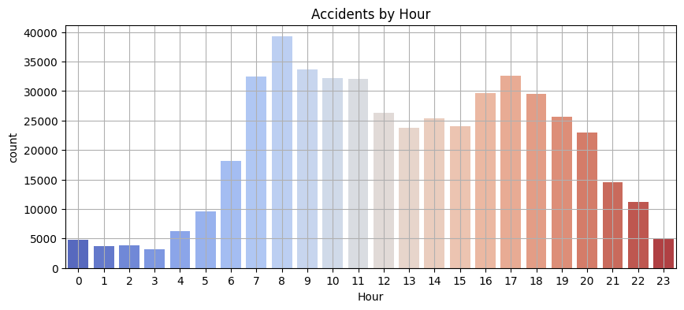
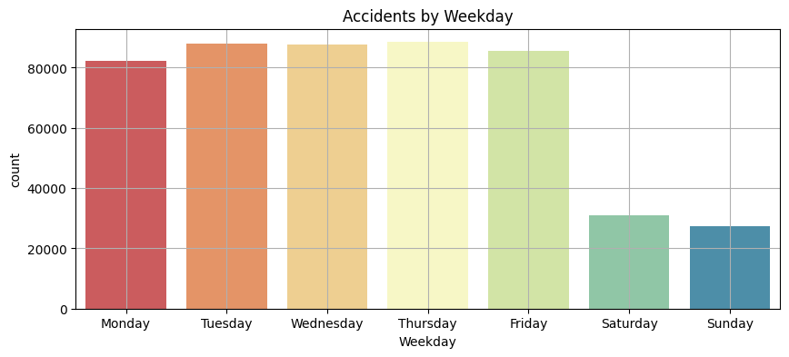
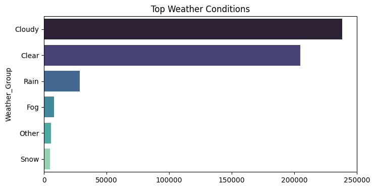
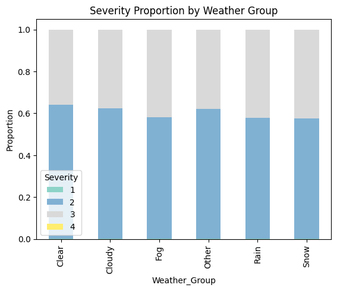
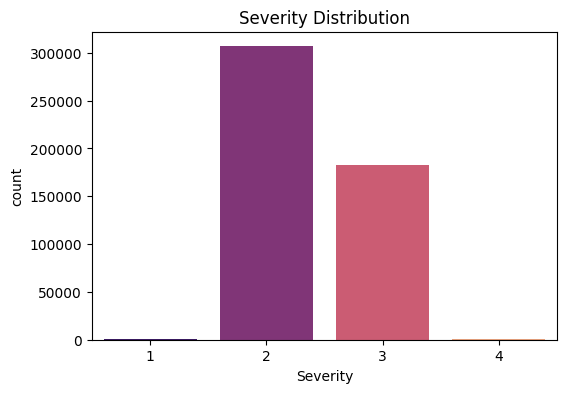
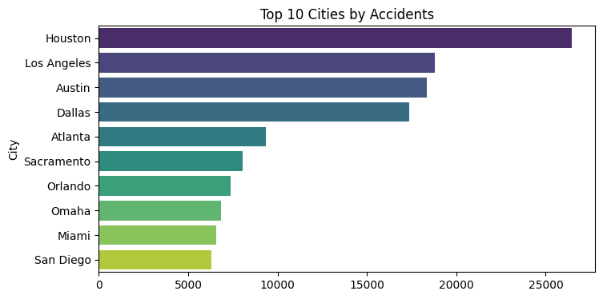
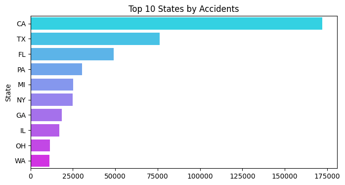

# 🚗 US Accidents EDA (500K Sample) — Prodigy InfoTech

This project performs Exploratory Data Analysis on a 500,000-row sample from the US Accidents dataset to identify trends by time, weather, severity, and location.

📊 Dataset Source: [Kaggle – US Accidents (March 2023)](https://www.kaggle.com/datasets/sobhanmoosavi/us-accidents)

---

## 📈 Visualizations

### 1. Accidents by Hour  

### 2. Accidents by Weekday  

### 3. Weather Conditions  

### 4. Severity by Weather Group  

### 5. Severity Distribution  

### 6. Top 10 Cities  

### 7. Top 10 States  

---

## 🗺️ Hotspot Map

An interactive heatmap built with Plotly is included in the notebook to visualize accident density.

---

## 🧰 Tech Stack

- Python, Pandas, Matplotlib, Seaborn, Plotly
- Google Colab (free tier, RAM-efficient with `nrows=500000`)

---

## 👤 Author

**Kashish Sharma**  
[GitHub](https://github.com/sharmakashishh) • [LinkedIn](https://www.linkedin.com/in/kashishsharma14)
